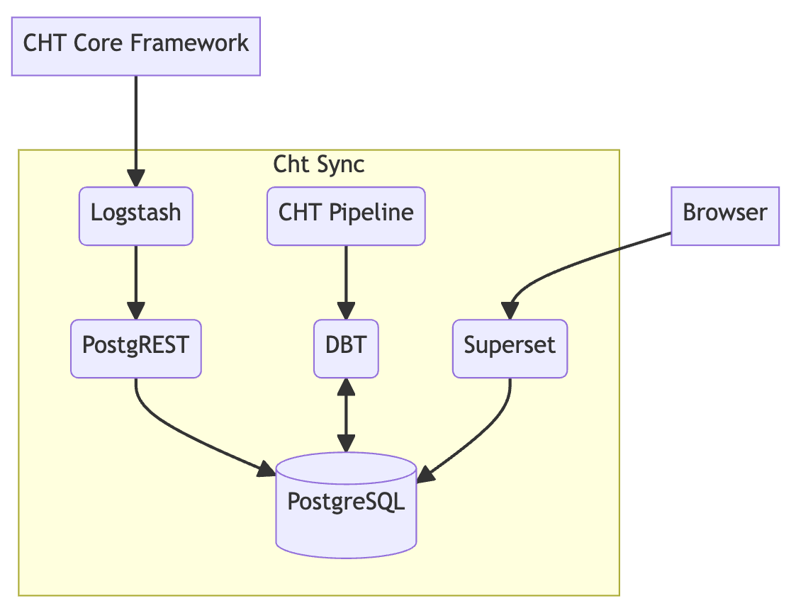

# CHT Sync

CHT Sync is a bundled solution consisting of [Logstash](https://www.elastic.co/logstash/), [CouchDB](https://couchdb.apache.org/), [PostgREST](https://postgrest.org/en/stable/), [DBT](https://www.getdbt.com/), and [Superset](https://superset.apache.org/). Its purpose is to synchronize data from CouchDB to PostgreSQL, facilitating analytics on a Superset dashboard. This synchronization occurs in real-time, ensuring that the data displayed on the dashboard is always up-to-date. CHT Sync copies data from CouchDB to PostgreSQL, enabling seamless integration and timely analytics.

**WARNING!** The schema differs from couch2pg. See [`./postgres/init-db-resources.sh`](./postgres/init-db-resources.sh).

**Note**: In order for `cht-sync` to run, it needs a link to [cht-pipeline](https://github.com/medic/cht-pipeline), which contains transformation models for DBT.

## Getting Started

CHT sync has been specifically designed to work in both local development environments for testing models or workflows, gamma environment, as well as in production environments. Each setup accommodates the needs of different stages or environment.

### Prerequisites

- `Docker`

### Local Setup

The local environment setup involves starting Logstash, PostgreSQL, PostgREST, DBT, and CouchDB. This configuration facilitates data synchronization, transformation, and storage for local development and testing. Fake data is generated for CouchDB. The required environment variables can be found in the `env.template` file, which should be customized accordingly for the specific deployment needs.

1. Provide the databases you want to sync in the `.env` file:

```
COUCHDB_DBS=<dbs-to-sync> # space separated list of databases you want to sync e.g "medic medic_sentinel"
```

```sh
# starts: logstash, superset, postgres, postgrest,  data-generator, couchdb and dbt
npm install
npm run local
```
#### Run end-to-end test locally
1. Update the following environment variables in your .env file:

```
# project wide: optional
COMPOSE_PROJECT_NAME=pipeline

# postgrest and pogresql: required environment variables for 'gamma', prod and 'local'
POSTGRES_USER=root
POSTGRES_PASSWORD=supercoolpassword
POSTGRES_DB=data
POSTGRES_TABLE=couchdb # for dbt use only
POSTGRES_SCHEMA=v1

# dbt: required environment variables for 'gamma', 'prod' and 'local'
DBT_POSTGRES_USER=dbt_user
DBT_POSTGRES_PASSWORD=supercoolpassword
DBT_POSTGRES_SCHEMA=dbt
DBT_POSTGRES_HOST=postgres # Your postgres instance IP or endpoint in "prod".
CHT_PIPELINE_BRANCH_URL="https://github.com/medic/cht-pipeline.git#main"

# couchdb and logstash: required environment variables for 'gamma', 'prod' and 'local'
COUCHDB_USER=test
COUCHDB_PASSWORD=test
COUCHDB_DBS="couchdb couchdb_sentinel" # space separated list of databases you want to sync e.g "medic medic_sentinel"
COUCHDB_HOST=couchdb
COUCHDB_PORT=5984
COUCHDB_SECURE=false

# superset: required environment variables for 'gamma', 'prod' and 'local'
SUPERSET_PASSWORD=password
SUPERSET_ADMIN_EMAIL=user@superset.com
```

2. Install and run locally

```sh
# starts: logstash, superset, postgres, postgrest,  data-generator, couchdb and dbt
npm install
npm run local
```

3. Wait for every container to be up and running.
4. Run end-to-end test

```sh
# starts: logstash, superset, postgres, postgrest,  data-generator, couchdb and dbt
npm test
```

### Gamma Setup

The gamma environment setup involves starting Logstash, PostgreSQL, PostgREST, and DBT. This configuration facilitates data synchronization, transformation, and storage for medic gamma hosting. The required environment variables can be found in the `env.template` file, which should be customized accordingly for the specific deployment needs.

1. Update the following environment variables in your `.env` file:

```
# project wide: optional
COMPOSE_PROJECT_NAME=pipeline

COUCHDB_DBS=<dbs-to-sync> # space separated list of databases you want to sync e.g "medic medic_sentinel"

# couchdb and logstash: required environment variables for 'gamma', 'prod' and 'local'
COUCHDB_PASSWORD=<your-couchdb-password>
COUCHDB_SECURE=false
```

1. Start docker containers
```sh
# starts: logstash, superset, postgres, postgrest, and dbt
npm install
npm run gamma
```

### Production Setup

The production environment setup involves starting Logstash, PostgREST, and DBT. This configuration facilitates data synchronization, transformation, and storage for CHT production hosting. The required environment variables can be found in the `env.template` file, which should be customized accordingly for the specific deployment needs.

1. Update the following environment variables in your `.env` file:

```
# project wide: optional
COMPOSE_PROJECT_NAME=pipeline

COUCHDB_DBS=<dbs-to-sync> # space separated list of databases you want to sync e.g "medic medic_sentinel"

# postgrest and pogresql: required environment variables for 'gamma', prod and 'local'
POSTGRES_USER=<your-postgres-user>
POSTGRES_PASSWORD=<your-postgres-password>
POSTGRES_DB=<your-database>
POSTGRES_TABLE=<your-postgres-table>
POSTGRES_SCHEMA=<your-base-postgres-schema>

# dbt: required environment variables for 'gamma', 'prod' and 'local'
DBT_POSTGRES_USER=<your-postgres-dbt-user>
DBT_POSTGRES_PASSWORD=<your-postgres-password>
DBT_POSTGRES_SCHEMA=<your-dbt-postgres-schema>
DBT_POSTGRES_HOST=<your-postgres-host> # IP address

# couchdb and logstash: required environment variables for 'gamma', 'prod' and 'local'
COUCHDB_PASSWORD=<your-couchdb-password>
COUCHDB_HOST=<your-couchdb-host>
COUCHDB_PORT=<your-couchdb-port>
COUCHDB_SECURE=false
```

1. (Optional) Start local version of PostgreSQL
```
docker-compose -f docker-compose.postgres.yml -f docker-compose.yml up postgres
```

1. Start docker containers
```sh
# starts: logstash, superset, postgrest and dbt
npm install
npm run prod
```

## Environment Variables

The required environment variables and their corresponding environments can be found in the `env.template` file. These variables must be present either in a `.env` file located in the root directory of the project or set by the operating system.

## Architecture



CHT-sync is an integrated solution designed to enable data synchronization between CouchDB and PostgreSQL for the purpose of analytics. It combines several technologies to achieve this seamless synchronization and provide an efficient workflow for data processing and visualization.

At the core of the CHT-sync toolkit are Logstash, PostgREST, and DBT. Logstash plays a key role in the data synchronization process, facilitating the extraction of data from CouchDB and transferring it to PostgREST, ensuring real-time updates in PostgreSQL. PostgREST, on the other hand, acts as a RESTful API layer, enabling convenient interactions with PostgreSQL for data storage and retrieval.

Once the data is synchronized and stored in PostgreSQL, it undergoes transformation using predefined DBT models from the [cht-pipeline](https://github.com/medic/cht-pipeline). DBT plays a crucial role in preparing the data in a format that is optimized for querying and analysis, ensuring the data is readily available for analytics purposes.

CHT-sync also leverages Superset, an analytics and dashboarding platform, to provide intuitive visualizations and interactive analytics on the synchronized data stored in PostgreSQL. Superset empowers users to explore and gain valuable insights from the data, enabling informed decision-making and data-driven actions.

The overall architecture of CHT-sync is driven by the seamless integration of these technologies. CouchDB serves as the source database, containing the original data to be synchronized. Logstash, PostgREST, and DBT facilitate the data flow from CouchDB to PostgreSQL, transforming it into a queriable format. PostgreSQL acts as the centralized repository for the synchronized and transformed data, while Superset provides the interface for users to explore and visualize the analytics.
